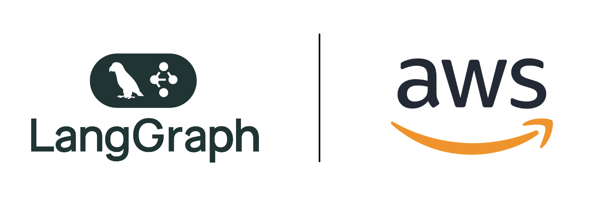

## LangGraph


LangGraph is a low-level orchestration framework for building controllable agents. While langchain provides integrations and composable components to streamline LLM application development, the LangGraph library enables agent orchestration — offering customizable architectures, long-term memory, and human-in-the-loop to reliably handle complex tasks.

## LangGraph Official Documentation

**Docs:** https://langchain-ai.github.io/langgraph/tutorials/introduction/

## LangGraph + AWS

### Importing LLMs from Amazon Bedrock

**Model IDs Supported in Amazon Bedrock:** https://docs.aws.amazon.com/bedrock/latest/userguide/models-supported.html

**LLM Configuration:** 

Using Bedrock Endpoint (boto3):
```
from langchain_aws import ChatBedrockConverse 
from langchain_aws import ChatBedrock

bedrock_client = boto3.client("bedrock-runtime", region_name="<region_name>")

llm = ChatBedrockConverse(
        model="anthropic.claude-3-haiku-20240307-v1:0",
        temperature=0,
        max_tokens=None,
        client=bedrock_client,
        # other params...
    )

llm.invoke(input="What is the recipe of mayonnaise?")

```

Using Sagemaker Endpoint
```
from langchain_community.llms import SagemakerEndpoint

llm=SagemakerEndpoint(
        endpoint_name=endpoint_name,
        region_name="us-east-1",
        model_kwargs={"max_new_tokens": 500, "do_sample": True, "temperature": 0.001}, #extending the max_tokens is VITAL, as the response will otherwise be cut, breaking the agent functionality by not giving it access to the LLM's full answer. The value has been picked empirically
        content_handler=content_handler
    )
```