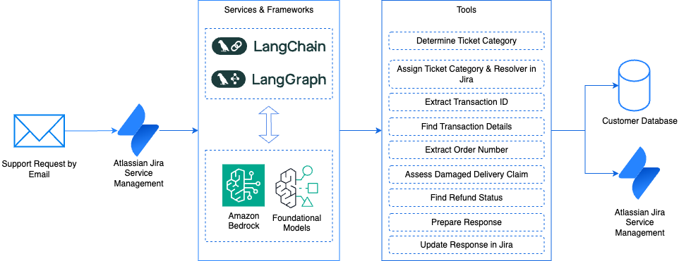

# Customer Support Automation with Amazon Bedrock and LangGraph

This example demonstrates how to automate customer support using Amazon Bedrock, LangGraph, and Mistral models. The solution processes customer support tickets from Jira, categorizes them, extracts relevant information, and generates appropriate responses.

## Architecture



The solution implements an intelligent customer support workflow that:
- Integrates with Jira for ticket management
- Uses Amazon Bedrock with Mistral models for natural language processing
- Implements vision capabilities for image analysis
- Applies guardrails for safe AI responses
- Maintains conversation state and memory

## Features

- **Automated Ticket Categorization**: Classifies tickets into Transaction, Delivery, Refunds, or Other categories
- **Multi-modal Processing**: Handles both text and image inputs for comprehensive ticket analysis
- **Database Integration**: Queries customer data, orders, transactions, and refunds
- **Vision Analysis**: Compares product images for damage assessment
- **Guardrails Integration**: Ensures safe and appropriate AI responses
- **Jira Integration**: Updates tickets with generated responses and categories

## Prerequisites

- AWS Account with Amazon Bedrock access
- Jira instance with API access
- Python 3.8+
- Required AWS permissions for Bedrock services

## Installation

1. Install dependencies:
```bash
pip install -r requirements.txt
```

2. Set up environment variables:
```bash
export AWS_REGION=your-region
export JIRA_URL=your-jira-url
export JIRA_USERNAME=your-username
export JIRA_API_TOKEN=your-api-token
```

## Usage

### Running the Complete Workflow

```python
python main.py
```

This will:
1. Initialize the database with sample data
2. Create Bedrock guardrails
3. Process sample tickets (AS-5 and AS-6)
4. Clean up guardrails

### Processing Individual Tickets

```python
from main import generate_response_for_ticket
generate_response_for_ticket('TICKET-ID')
```

### Using the Jupyter Notebook

Open `Customer_Support_Automation_with_Bedrock_and_LangGraph.ipynb` for an interactive walkthrough of the solution.

## Workflow Components

### Core Modules

- **`cs_cust_support_flow.py`**: Main workflow orchestration using LangGraph
- **`cs_bedrock.py`**: Amazon Bedrock client and model initialization
- **`cs_jira_sm.py`**: Jira integration for ticket management
- **`cs_db.py`**: Database operations for customer data
- **`cs_util.py`**: Utility functions and logging

### Workflow Steps

1. **Ticket Categorization**: Analyze ticket content to determine category
2. **Information Extraction**: Extract transaction IDs or order numbers
3. **Data Retrieval**: Query relevant databases for context
4. **Response Generation**: Create appropriate customer responses
5. **Jira Updates**: Update tickets with responses and metadata

## Sample Data

The `data/` folder contains:
- Customer records (`customers.json`)
- Order information (`orders.json`)
- Transaction data (`transactions.json`)
- Refund records (`refunds.json`)
- Sample product images for vision analysis

## Configuration

### Bedrock Models
- **Text Model**: Mistral Large for text processing
- **Vision Model**: Claude 3 Sonnet for image analysis
- **Guardrails**: Custom guardrails for content filtering

### Database Schema
- SQLite database with tables for customers, orders, transactions, and refunds
- Automatic data import from JSON files

## Related Resources

- [AWS Blog Post](https://aws.amazon.com/blogs/machine-learning/automate-customer-support-with-amazon-bedrock-langgraph-and-mistral-models/)
- [Amazon Bedrock Documentation](https://docs.aws.amazon.com/bedrock/)
- [LangGraph Documentation](https://langchain-ai.github.io/langgraph/)

